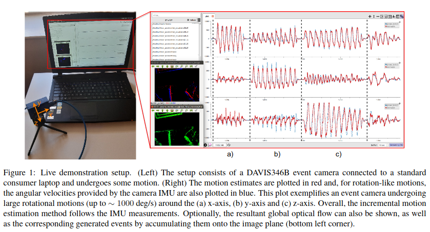

# event_emin_ros

[](https://creativecommons.org/licenses/by-nc-sa/4.0/)

ROS wrapper for real-time incremental event-based vision motion estimation by dispersion minimisation ([EventEMin](https://github.com/ImperialCollegeLondon/EventEMin)).
This code was used to demonstrate live incremental motion estimation using a DAVIS346B.
We used [PlotJuggler](https://github.com/facontidavide/PlotJuggler) to show the motion estimates compared to IMU measurements in a graph similar to the one below:



If you use this code in a scientific publication, please cite the following papers:

- [Entropy Minimisation Framework for Event-based Vision Model Estimation](http://www.ecva.net/papers/eccv_2020/papers_ECCV/papers/123500154.pdf)
- [Robust Event-based Vision Model Estimation by Dispersion Minimisation](https://ieeexplore.ieee.org/document/9625712)
- [Live Demonstration: Incremental Motion Estimation for Event-based Cameras
  by Dispersion Minimisation](https://openaccess.thecvf.com/content/CVPR2021W/EventVision/papers/Nunes_Live_Demonstration_Incremental_Motion_Estimation_for_Event-Based_Cameras_by_Dispersion_CVPRW_2021_paper.pdf)

The authors provide this code in the hope it will be useful for understanding the proposed method, as well as for reproducibility of the results.

For more information and more open-source software please visit the Personal Robotic Lab's website: <https://www.imperial.ac.uk/personal-robotics/software/>.

## Requirements

This code was tested on Ubuntu 16.04, 18.04 and 20.04, and respective ROS versions, using a DAVIS346B live.
It was also tested using bag files recorded by a DAVIS240.

### Dependencies

- EventEMin (no need to install, just ensure all dependencies are met; you do not need to install GSL - GNU): <https://github.com/ImperialCollegeLondon/EventEMin>

- ROS: <http://wiki.ros.org/ROS/Installation>

- rpg_dvs_ros: <https://github.com/uzh-rpg/rpg_dvs_ros>

### General

We assume you already have a `catkin_ws` environment.
On a terminal type:

```bash
cd ~/catkin_ws/src
git clone --recurse-submodules https://github.com/ImperialCollegeLondon/event_emin_ros.git
cd ..
catkin build event_emin_ros
```

## Usage

Open a terminal and run:

```bash
roscore
```

This package assumes that there are two active publishers for `events` and `camera info`.
Then, on a terminal type:

```bash
rosrun event_emin_ros <model> camera_info:=/subscribe/to/camera_info events:=/subscribe/to/events
```

For example, assuming you are already running the `rpg_dvs_ros` package, to estimate rotational motion type:

```bash
rosrun event_emin_ros rotation camera_info:=/dvs/camera_info events:=/dvs/events
```

The estimated variables are published by default to the topic `/event_emin_ros/vars`, and whose type is a standard vector (see [message type](msg/Vars.msg)).

### Launch Files

[Launch files](launch) are also provided for convenience. For example:

```bash
roslaunch event_emin_ros global_motion.launch model:=<model> camera_ns:=<camera>
```

assumes another node is publishing `camera_info` and `events` messages, either from a live camera of a bag file, on the `camera_ns` namespace (by default the camera namespace is `/camera`).
The following models are currently supported: `affinity`, `isometry`, `rotation`, `similarity`, `translation2d`.

## License

The event_model_ros code is licensed under [CC BY-NC-SA 4.0](https://creativecommons.org/licenses/by-nc-sa/4.0/). Commercial usage is not permitted.
